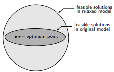

```{r setup, include=FALSE}
knitr::opts_chunk$set(echo = TRUE)

rm(list=ls())
library(dplyr)
library(ggplot2)
```

\newpage
\tableofcontents
\newpage
\listoffigures
\newpage
\listoftables

\newpage

# SEJARAH 

## Optimisasi

Optimisasi adalah __proses mencari nilai yang optimal__ dari suatu masalah tertentu. Dalam matematika, optimisasi merujuk pada pencarian nilai minimal atau maksimal dari suatu _fungsi real_^[https://id.wikipedia.org/wiki/Optimisasi]. Notasi matematikanya dapat ditulis sebagai berikut:

Misalkan suatu fungsi $f$ yang memetakan dari himpunan $A$ ke bilangan _real_.

$$f: A \rightarrow \mathbb{R}$$

Cari suatu nilai $x_0 \in A$ sedemikian sehingga:

- $f(x_0) \leq f(x), \forall x \in A$ untuk proses __minimalisasi__.
- $f(x_0) \geq f(x), \forall x \in A$ untuk proses __maksimalisasi__.

Di dalam kalkulus, kita mengetahui salah satu pendekatan optimisasi di fungsi satu variabel bisa didapatkan dari turunan pertama yang bernilai __nol__ (bisa berupa nilai maksimum atau minimum dari fungsi tersebut).

Nilai $x_0 \in [a,b]$ disebut minimum atau maksimum di $f$ unimodal saat memenuhi:

$$\frac{d}{dx}f(x_0) = 0$$

__Pierre De Fermat__ dan __Joseph-Louis Lagrange__ adalah orang-orang yang pertama kali menemukan formula kalkulus untuk mencari nilai optimal. Sementara __Isaac Newton__ dan __Johann C. F.Gauss__ mengusulkan metode iteratif untuk mencari nilai optimal^[https://empowerops.com/en/blogs/2018/12/6/brief-history-of-optimization]. 

Salah satu bentuk optimisasi yakni _linear programming_ dimulai oleh __Leonid Kantorovich__ pada 1939. __Metode Simplex__ merupakan salah satu metode penyelesaian optimisasi yang terkenal, pertama kali diperkenalkan pada 1947 oleh __George Dantzig__ sementara di tahun yang sama _Theory of Duality_ diperkenalkan oleh __John von Neumann__. 

## Riset Operasi

__Riset operasi__ adalah metode antar disiplin ilmu yang digunakan untuk menganalisa masalah nyata dan membuat keputusan untuk kegiatan operasional organisasi atau perusahaan^[Pengantar Riset Operasi dan Optimisasi, KampusX: PO101]. 

Riset operasi dimulai pada era Perang Dunia II. Oleh karena peperangan, diperlukan suatu cara yang efektif untuk mengalokasikan _resources_ yang ada sehingga pihak militer Inggris dan Amerika Serikat mengumpulkan ilmuwan-ilmuwan untuk mencari pendekatan yang saintifik dalam memecahkan masalah[@lieberman].

Pada tahun 1940, sekelompok _researchers_ yang dipimpin oleh __PMS Blackett__ dari ___the University of Manchester___ melakukan studi tentang __Sistem Radar Baru Anti Pesawat Terbang__. Kelompok _researchers_ ini sering dijuluki sebagai __Kelompok Sirkus Blackett__ (_Blackett’s circus_). Julukan ini terjadi karena keberagaman latar belakang disiplin ilmu para _researchers_ tersebut. Mereka terdiri dari disiplin ilmu fisiologi, matematika, astronomi, tentara, surveyor, dan fisika. Pada 1941, kelompok ini terlibat dalam penelitian radar deteksi kapal selam dan pesawat terbang. _Blackett_ kemudian memimpin _Naval Operational Research_ pada Angkatan Laut Kerajaan Inggris Raya. Prinsip-prinsip ilmiah yang digunakan untuk mengambil keputusan dalam suatu operasi dinamai sebagai __Riset Operasi__[@vincentius].

Saat Amerika Serikat mulai terlibat pada Perang Dunia II, prinsip riset operasi juga digunakan untuk berbagai operasi militer mereka. Kelompok riset operasi AS bertugas untuk menganalisis serangan udara dan laut tentara NAZI Jerman.

Selepas Perang Dunia II, penerapan riset operasi dinilai bisa diperluas ke dunia ekonomi, bisnis,_engineering_, dan sosial. Riset operasi banyak berkaitan dengan berbagai disiplin ilmu seperti matematika, statistika, _computer science_, dan lainnya. Tidak jarang beberapa pihak menganggap riset operasi itu _overlapping_ dengan disiplin-disiplin ilmu tersebut. 

Oleh karena tujuan utama dari aplikasi riset operasi adalah tercapainya __hasil yang optimal__ dari semua kemungkinan perencanaan yang dibuat. Maka __pemodelan matematika dan optimisasi__ bisa dikatakan sebagai disiplin utama dari riset operasi.

# OPTIMISASI 

## Bahasan dalam Optimisasi

Bahasan dalam optimisasi dapat dikategorikan menjadi:

- Pemodelan masalah nyata menjadi masalah optimisasi.
- Pembahasan karakteristik dari masalah optimisasi dan keberadaan solusi dari masalah optimisasi tersebut.
- Pengembangan dan penggunaan algoritma serta analisis numerik untuk mencari solusi dari masalah tersebut.

## Masalah Optimisasi

__Masalah optimisasi__ adalah masalah matematika yang mewakili masalah nyata (_real_). Dari ekspresi matematika tersebut, ada beberapa hal yang perlu diketahui^[Pengantar Riset Operasi dan Optimisasi, KampusX: PO101], yakni:

1. __Variabel__ adalah suatu simbol yang memiliki banyak nilai dan nilainya ingin kita ketahui. Setiap nilai yang mungkin dari suatu variabel muncul akibat suatu kondisi tertentu di sistem.
1. __Parameter__ di suatu model matematika adalah suatu konstanta yang menggambarkan suatu karakteristik dari sistem yang sedang diteliti. Parameter bersifat _fixed_ atau _given_.
1. ___Constraints___ (atau kendala) adalah kondisi atau batasan yang harus dipenuhi. Kendala-kendala ini dapat dituliskan menjadi suatu persamaan atau pertaksamaan. Suatu masalah optimisasi dapat memiliki hanya satu kendala atau banyak kendala.
1. ___Objective function___ adalah satu fungsi (pemetaan dari variabel-varibel keputusan ke suatu nilai di daerah _feasible_) yang nilainya akan kita minimumkan atau kita maksimumkan.

Ekspresi matematika dari model optimisasi adalah sebagai berikut:

> Cari $x$ yang meminimumkan $f(x)$ dengan kendala $g(x) = 0, h(x) \leq 0$ dan $x \in D$.

Dari ekspresi tersebut, kita bisa membagi-bagi masalah optimisasi tergantung dari:

1. Tipe variabel yang terlibat.
1. Jenis fungsi yang ada (baik _objective function_ ataupun _constraints_).

## Jenis-Jenis Masalah Optimisasi

Masalah optimisasi bisa dibagi dua menjadi dua kategori berdasarkan tipe _variables_ yang terlibat^[Optimization problem. https://en.wikipedia.org/wiki/Optimization_problem], yakni:

```{r,echo=FALSE,message=FALSE,warning=FALSE,fig.align='center',fig.cap="Optimisasi Berdasarkan Jenis Variabel"}
nomnoml::nomnoml("#direction: down
                 [Optimisasi] -> [Diskrit]
                 [Optimisasi] -> [Kontinu]
                 
                 [Diskrit] -> [Binary\nProgramming]
                 [Diskrit] -> [Integer\nProgramming]
                 [Diskrit] -> [Mixed Integer\nLinear Programming]
                 
                 [Kontinu] -> [Diferensiabel]
                 [Kontinu] -> [Non Diferensiabel]
                 
                 [Diferensiabel] -> [Linear\nProgramming]
                 [Diferensiabel] -> [Non Linear\nProgramming]
                 [Diferensiabel] -> [Quadratic\nProgramming] 
                 
                 [Linear\nProgramming] --> [Mixed Integer\nLinear Programming]
                 ")
```


1. _Discrete Optimization_: merupakan masalah optimisasi di mana variabel yang terkait merupakan variabel diskrit, seperti _binary_ atau _integer_ (bilangan bulat). Namun pada masalah optimisasi berbentuk _mixed integer linear programming_, dimungkinkan suatu masalah optimisasi memiliki berbagai jeni variabel yang terlibat (integer dan kontinu sekaligus).
1. _Continuous Optimization_: merupakan masalah optimisasi di mana variabel yang terkait merupakan variabel kontinu (bilangan _real_). Pada masalah optimisasi jenis ini, fungsi-fungsi yang terlibat bisa diferensiabel atau tidak. Konsekuensinya adalah pada metode penyelesaiannya.

Selain itu, kita juga bisa membagi masalah optimisasi berdasarkan __kepastian nilai__ ___variable___ __dan parameter__ yang dihadapi sebagai berikut:

```{r,echo=FALSE,message=FALSE,warning=FALSE,fig.align='center',fig.cap="Optimisasi Berdasarkan Kepastian Nilai"}
nomnoml::nomnoml("#direction: down
                 [Optimisasi] -> [Uncertainty]
                 [Optimisasi] -> [Certain|Deterministic]
                 
                 [Uncertainty] -> [Stokastik\nprogramming]
                 [Uncertainty] -> [Robust\noptimization]
                 
                 [Certain] -> [Kontinu]
                 [Certain] -> [Diskrit]
                 ")
```

1. _Optimization under uncertainty_^[https://neos-guide.org/content/optimization-under-uncertainty]; Pada beberapa kasus di dunia _real_, data dari masalah tidak dapat diketahui secara akurat karena berbagai alasan. Hal ini mungkin terjadi akibat:
    - Kesalahan dalam pengukuran, atau
    - Data melibatkan sesuatu di masa depan yang belum terjadi atau tidak pasti. Contoh: _demand_ produk, harga barang, dan sebagainya.
1. _Deterministic optimization_; 
    - Model deterministik adalah model matematika di mana nilai dari semua parameter dan variabel yang terkandung di dalam model merupakan satu nilai pasti^[Pengantar Riset Operasi dan Optimisasi, KampusX: PO101].
    - Pendekatan deterministik memanfaatkan sifat analitik masalah untuk menghasilkan barisan titik yang konvergen ke solusi optimal[@hindawi]. 
    - Semua algoritma perhitungan mengikuti pendekatan matematis yang ketat[@marco].

## _Supplier Selection Problem_

Tema penelitian yang diangkat adalah _supplier selection problem_.

#### Latar Belakang {-}

Suatu perusahaan makanan dan minuman memproduksi $>130$ jenis produk perbulannya dengan kuantitas yang disesuaikan dengan _sales forecast_ pada bulan tersebut. Untuk memproduksi satu jenis produk, dibutuhkan beberapa _raw material_. Perusahaan tersebut menggunakan strategi _multi supplier_ untuk menjaga keberadaan stok _raw material_. Artinya satu jenis _raw material_ bisa dibeli di beberapa _supplier_ yang berbeda. Akibatnya timbul perbedaan dalam hal:

1. Harga (per ton),
1. Minimum tonase pembelian,
1. _Delivery time_.

Mengenai kualitas _raw material_, __sudah dipastikan__ bahwa tidak ada perbedaan antar _supplier_ karena pemilihannya melalui proses seleksi yang ketat.

#### Masalah yang Dihadapi {-}

adalah meminimalkan ongkos pembelian _raw material_ dengan tetap mengamankan stok _raw material_ agar proses produksi tetap berjalan.

Masalah ini termasuk ke dalam masalah optimisasi deterministik yakni _mixed integer linear programming_ (_MILP_), alasannya:

1. Parameter dan variabel yang terlibat merupakan suatu nilai pasti.
1. Variabel yang terlibat meliputi:
    - _Binary_ karena melibatkan pengambilan keputusan _raw material_ dari _supplier_ mana yang harus dipesan.
    - _Continuous_ karena melibatkan angka kuantitas _raw material_ yang harus dipesan. 
1. Fungsi _objective_ dan _constraints_ masih berupa _linear_.
    - Meminimumkan ongkos pembelian $harga \times tonase$.
    - Kapasitas gudang _raw material_ dan rencana produksi produk.
    - dan seterusnya.

\newpage

# JENIS OPTIMISASI

## _Linear Programming_

_Linear programming_ adalah bentuk metode optimisasi sederhana yang memanfaatkan relasi linear (semua fungsi dan _constraints_ merupakan fungsi linear).

### Contoh Masalah _Linear Programming_

Saya memiliki area parkir seluas 1.960 $m^2$. Luas rata-rata untuk mobil berukuran kecil adalah 4 $m^2$ dan mobil besar adalah 20 $m^2$. Daya tampung maksimum hanya 250 kendaraan, biaya parkir mobil kecil adalah Rp 7.000 per jam dan mobil besar adalah Rp 12.000 per jam. Jika dalam 1 jam area parkir saya terisi penuh dan tidak ada kendaraan yang pergi dan datang, maka berapa pendapatan maksimum yang bisa saya dapatkan dari tempat parkir itu?

Dari kasus di atas kita bisa tuliskan model matematikanya sebagai berikut:

Misal $x_1$ adalah mobil kecil dan $x_2$ adalah mobil besar.

$$max(7000x_1 + 12000x_2)$$

Dengan _constraints_: 

$$4 x_1 + 20 x_2 \leq 1960$$

dan

$$x_1 + x_2 \leq 250$$

serta $x_1 \geq 0, x_2 \geq 0$.

## _Integer Programming_

_Integer programming_ adalah bentuk metode optimisasi di mana variabel yang terlibat merupakan bilangan bulat (_integer_). Jika fungsi-fungsi yang terkait merupakan _linear_, maka disebut dengan _integer linear programming_.

Sebagai contoh, variabel yang merupakan bilangan bulat adalah banyak orang.

### Contoh _Integer Programming_

#### Jadwal Kebutuhan Tenaga Kesehatan {-}

Suatu rumah sakit membutuhkan tenaga kesehatan setiap harinya dengan spesifikasi berikut:

```{r,echo=FALSE}
rm(list=ls())

nakes = data.frame(
  hari = c('Senin','Selasa','Rabu','Kamis','Jumat','Sabtu','Minggu'),
  min = c(24,22,23,11,16,20,12),
  max = c(29,27,28,16,21,25,17)
)

nakes %>%
  rename("Min Nakes Required" = min,
	 "Max Nakes Required" = max) %>%
  knitr::kable("simple",align = "c",caption = "Tabel Kebutuhan Nakes Harian")
```

Di rumah sakit tersebut berlaku kondisi sebagai berikut:

1. Setiap nakes hanya diperbolehkan bekerja selama 5 hari berturut-turut dan harus libur selama 2 hari berturut-turut.
1. Tidak ada pemberlakuan _shift_ bagi nakes.

Berapa banyak nakes yang harus dipekerjakan oleh rumah sakit tersebut? Bagaimana konfigurasi penjadwalannya?

Untuk memudahkan dalam mencari solusi permasalahan di atas, kita bisa membuat tabel ilustrasi berikut:

```{r,echo=FALSE}
nakes %>%
  mutate(x1 = c('x','x','x','x','x','' , ''),
	 x2 = c('' ,'x','x','x','x','x', ''),
	 x3 = c('' , '','x','x','x','x','x'),
	 x4 = c('x', '', '','x','x','x','x'),
	 x5 = c('x','x', '', '','x','x','x'),
	 x6 = c('x','x','x', '', '','x','x'),
	 x7 = c('x','x','x','x', '', '','x')) %>%
  rename("Min Nakes Required" = min,
	 "Max Nakes Required" = max) %>%
  knitr::kable("simple",align = "c",caption = "Konfigurasi Penjadwalan Nakes")
```

Kolom $x_i, i =1,2,3,4,5,6,7$ menandakan kelompok nakes yang perlu dipekerjaan pada hari-hari tertentu. Setiap nilai $x_i$ tersebut merupakan __bilangan bulat positif__ $x \geq 0, x \in \mathbb{Z}$.

Dari ilustrasi di atas, kita bisa membuat model optimisasinya sebagai berikut:

___Objective Function___

$$\min{ \sum_{i=1}^7 x_i}$$

___Constraints___

- Hari Senin: $24 \leq \sum x_i \leq 29, i \in \{1,4,5,6,7\}$.
- Hari Selasa: $22 \leq \sum x_i \leq 27, i \in \{1,2,5,6,7\}$.
- Hari Rabu: $23 \leq \sum x_i \leq 28, i \in \{1,2,3,6,7\}$.
- Hari Kamis: $11 \leq \sum x_i \leq 16, i \in \{1,2,3,4,7\}$.
- Hari Jumat: $16 \leq \sum x_i \leq 21, i \in \{1,2,3,4,5\}$.
- Hari Sabtu: $20 \leq \sum x_i \leq 25, i \in \{2,3,4,5,6\}$.
- Hari Minggu: $12 \leq \sum x_i \leq 17, i \in \{3,4,5,6,7\}$.

Kita juga perlu perhatikan bahwa $x_i \geq 0, i \in \{1,2,3,4,5,6,7\}$.

## _Binary Programming_

_Binary programming_ adalah bentuk metode optimisasi di mana variabel yang terlibat merupakan bilangan biner (0,1). Biasanya metode ini dipakai dalam masalah penjadwalan yang memerlukan prinsip _matching_ antar kondisi yang ada.

### Contoh _Binary Programming_

#### Jadwal Tatap Muka Terbatas Sekolah {-}

Beberapa minggu ke belakang, kasus harian Covid semakin menurun. Pemerintah mulai melonggarkan aturan PPKM yang mengakibatkan sekolah-sekolah mulai menggelar pengajaran tatap muka terbatas (PTMT) untuk siswanya secara _offline_. 

Suatu sekolah memiliki kelas berisi 20 orang siswa. Mereka hendak menggelar PTMT dengana aturan sebagai berikut:

1. PTMT digelar dari Senin hingga Jumat (5 hari).
1. Dalam sehari, siswa yang boleh hadir dibatasi 4-8 orang saja.
1. Dalam seminggu, diharapkan siswa bisa hadir 2-3 kali.
1. Siswa yang hadir di selang sehari baru bisa hadir kembali.

Dari uraian di atas, kita bisa membuat model optimisasinya sebagai berikut:

Saya definisikan $x_{i,j} \in (0,1)$ sebagai bilangan biner di mana $i \in \{1,2,..,20\}$ menandakan siswa dan $j \in \{1,2,..,5\}$ menandakan hari. Berlaku:

$$x_{i,j} = \left\{\begin{matrix}
0, \text{ siswa i tidak masuk di hari j}\\ 
1, \text{ siswa i masuk di hari j}
\end{matrix}\right.$$

___Objective Function___

Tujuan utama kita adalah memaksimalkan siswa yang hadir.

$$\max{\sum_{j=1}^5 \sum_{i=1}^{20} x_{i,j} }$$

___Constraints___

Dalam sehari, ada pembatasan jumlah siswa yang hadir.

$$4 \leq \sum_i x_{i,j} \leq 8, j \in \{1,2,..,5\}$$

Dalam seminggu, siswa hadir dalam frekuensi tertentu.

$$2 \leq \sum_j x_{i,j} \leq 3, i \in \{1,2,..,20\}$$

Ada jeda sehari agar siswa bisa masuk kembali.

$$x_{i,j} + x_{i,j+1} \leq 1$$

Jangan lupa bahwa $x_{i,j} \geq 0$.

## _Mixed Integer Linear Programming_

Pada bagian sebelumnya, kita telah membahas masalah optimisasi dengan variabel berupa diskrit dan kontinu. Permasalahan _real_ yang ada di kehidupan sehari-hari biasanya merupakan memiliki variabel yang _mixed_ antara keduanya. Oleh karena itu, ada metode yang disebut dengan _mixed integer linear programming_. Pada masalah optimisasi tipe ini, _decision variables_ yang terlibat bisa saja berupa _binary_, _integer_, dan _continuous_ sekaligus.

### Menyelesaikan _MILP_

_MILP_ secara eksak bisa diselesaikan dengan metode _simplex_ dengan dikombinasikan dengan teknik _branch and bound_. Penjelasan terkait ini akan dibahas pada bab `6`.

### Contoh _MILP_

#### Pemilihan dan Penentuan Item Produksi {-}

Suatu pabrik makanan dan minuman berencana untuk membuat tiga produk baru yang bisa diproduksi di dua _plants_ yang berbeda.

```{r,echo=FALSE}
rm(list=ls())

runtime = data.frame(Produk = c("Item 1","Item 2","Item 3"),
		     run1 = c(3,4,2),
		     run2 = c(4,6,2)
		    )
runtime %>%
  rename("Runtime Plant 1" = run1,
	 "Runtime Plant 2" = run2) %>%
  knitr::kable("simple",caption = "Tabel Runtime Item Produk per Plant (harian - dalam jam)")
```

__Plant 1__ memiliki maksimum _working hours_ sebesar 30 jam perhari.

__Plant 2__ memiliki maksimum _working hours_ sebesar 40 jam perhari.

```{r,echo=FALSE}
profit = data.frame(Produk = c("Item 1","Item 2","Item 3"),
		    profit = c(5,7,3),
		    sales = c(7,5,9)
			)

profit %>%
  rename("Profit per ton" = profit,
	 "Sales potential per ton" = sales) %>%
  knitr::kable("simple",caption = "Tabel Profit dan Potensi Sales Item Produk")
```

Masalah timbul saat mereka harus memilih __dua dari tiga__ produk baru tersebut yang harus di produksi. Selain itu, mereka juga harus memilih __satu dari dua__ _plants_ yang memproduksi _items_ tersebut.

Misalkan saya definisikan:

- $x_i \geq 0, i = 1,2,3$ sebagai `berapa ton` yang harus diproduksi dari item $i$.
- $y_i \in [0,1], i = 1,2,3$ sebagai _binary_.
	- Jika bernilai 0, maka produk $i$ tidak dipilih.
	- Jika bernilai 1, maka produk $i$ dipilih.
- $z \in [0,1]$ sebagai _binary_.
	- Jika bernilai 0, maka _plant_ pertama dipilih.
	- Jika bernilai 1, maka _plant_ kedua dipilih.

Saya akan mendefinisikan suatu variabel _dummy_ $M = 99999$ berisi suatu nilai yang besar. Kelak variabel ini akan berguna untuk _reinforce model_ (metode pemberian _penalty_) agar bisa memilih _items_ dan _plants_ secara bersamaan.

___Objective function___ dari masalah ini adalah memaksimalkan _profit_.

$$\max{ \sum_{i=1}^3 x_i \times \text{profit}_i }$$

___Constraints___ dari masalah ini adalah:

Tonase produksi tidak boleh melebihi angka _sales potential_ per items.

$$x_i \leq \text{sales potential}_i, i = 1,2,3$$

Kita akan memilih dua produk sekaligus menghitung tonase. Jika produk tersebut __dipilih__, maka akan ada angka tonase produksinya. Sebaliknya, jika produk tersebut __tidak dipilih__, maka tidak ada angka tonase produksinya.

$$x_i - y_i \times M \leq 0, i = 1,2,3$$

$$\sum_{i=1}^3 y_i \leq 2$$

Kita akan memilih _plant_ dari waktu produksinya.

$$3x_1 + 4x_2 + 2x_3 - M \times z \leq 30$$

$$4x_1 + 6x_2 + 2x_3 + M \times z \leq 40 + M$$

# ALGORITMA PENYELESAIAN OPTIMISASI

Pada bagian ini kita akan membahas macam-macam algoritma yang digunakan untuk menyelesaikan masalah optimisasi.

```{r,echo=FALSE,message=FALSE,warning=FALSE,fig.align='center',fig.cap="Algoritma Penyelesaian Optimisasi"}
nomnoml::nomnoml("#direction: down
                 [Algoritma\nOptimisasi] -> [Metode eksak]
                 [Algoritma\nOptimisasi] -> [Metode aproksimasi]
                 
                 [Metode eksak] -> [Iteratif]
                 [Metode eksak] -> [Enumeratif]
                 
                 [Metode aproksimasi] -> [AdHoc\nHeuristic]
                 [Metode aproksimasi] -> [Metaheuristic]
                 ")
```

Secara garis besar ada dua kelompok besar algoritma optimisasi, yakni:

1. _Exact method_,
1. _Approximate method_.

Perbedaan keduanya adalah pada __konsep atau pendekatan apa yang digunakan__ untuk menyelesaikan masalah optimisasi. Kita akan bahas satu-persatu pada bagian selanjutnya.

Dalam beberapa kasus, kita bisa mendapatkan _exact method_ bisa untuk menyelesaikan masalah optimisasi dengan efisien. Namun di kasus lain yang lebih kompleks tidak demikian. Kelemahan utama metode _exact_ adalah pada waktu komputasinya yang relatif lebih lama.

## _Exact Method_

Ciri khas dari _exact method_ adalah metode ini menjamin penyelesaian yang optimal karena menggunakan pendekatan analitis [@franz]. Salah satu contoh metode eksak adalah _Simplex Method_.

## _Approximate Method_

Ciri khas dari _approximate method_ adalah metode ini tidak menjamin penyelesaian yang optimal karena bersifat _aproksimasi_ atau pendekatan atau hampiran[@geovani]. Oleh karena itu kita perlu melakukan definisi di awal __seberapa dekat__ nilai __hampiran__ tersebut bisa kita terima.

Metode ini bisa dibagi menjadi dua berdasarkan keterkaitannya dengan suatu masalah, yakni:

1. _Heuristic_, metode ini bersifat _problem dependent_. Artinya metode tersebut hanya bisa dipakai untuk jenis permasalahan tertentu.
    - Contoh: metode _nearest neighborhood_ hanya bisa dipakai untuk menyelesaikan masalah dalam lingkup _travelling salesperson problem_ (__TSP__).
1. _Meta heuristic_, metode ini bersifat _problem independent_. Artinya metode tersebut tidak tergantung dari jenis permasalahan tertentu. Contoh: 
    - _Genetic algorithm_.
    - _Simulated annealing_.
    - _Spiral optimization_ untuk menyelesaikan masalah _mixed integer non linear programming_ [@kun].
    - _Artifical bee colony algorithm_.
    
Namun demikian kedua metode ini bisa saling melengkapi dalam prakteknya.


# METODE _SIMPLEX_

Metode _simplex_ adalah salah satu metode yang paling umum digunakan dalam menyelesaikan permasalahan _linear programming_. Metode ini dikembangkan oleh seorang profesor matematika bernama George Dantzig^[https://en.wikipedia.org/wiki/George_Dantzig] pada 1947 pasca perang dunia II. Sedangkan nama _simplex_ diusulkan oleh Theodore Motzkin^[https://en.wikipedia.org/wiki/Theodore_Motzkin].

Metode _simplex_ menggunakan prosedur aljabar[@lieberman]. Namun _underlying concept_ dari metode ini adalah _geometric_.

## Metode Simplex dengan Ilustrasi Geometris

Jika kita bisa memahami konsep geometrinya, kita bisa mengetahui bagaimana cara kerjanya dan kenapa metode ini sangat efisien.

Saya akan ambil satu contoh masalah optimisasi sederhana untuk memberikan ilustrasi bagaimana cara kerja metode ini.

#### Contoh Masalah Optimisasi {-}

Cari $x_1,x2$ yang $\max{(Z = 3x_1 + 5x_2)}$ dengan _constraints_:

$$\begin{matrix}
x1 \leq 4  \\
2x_2 \leq 12 \\
3x_1 + 2x_2 \leq 18 \\
\text{serta } x_1 \geq 0, x_2 \geq 0 \\
\end{matrix}$$

Masalah di atas jika dibuat grafiknya:

```{r,echo=FALSE,message=FALSE,warning=FALSE,fig.align='center',fig.cap="Grafik Permasalahan Optimisasi"}
rm(list=ls())
f = function(x1){(18-3*x1)/2}
data.frame(x = 0:6) %>% 
  mutate(y = f(x)) %>% 
  ggplot() +
  geom_line(aes(x,y),
            color = "red") +
  scale_x_continuous(breaks = c(-1:10)) +
  scale_y_continuous(breaks = c(-1:10)) +
  coord_equal() +
  geom_vline(xintercept = 0,
             color = "black",
             size = 1.1) +
  geom_hline(yintercept = 0,
             color = "black",
             size = 1.1) +
  geom_vline(xintercept = 4,
             color = "red") +
  geom_hline(yintercept = 6,
             color = "red") +
  annotate("segment",
           x = 0, xend = 0,
           y = 0, yend = 6,
           color = "red") +
  annotate("segment",
           x = 0, xend = 4,
           y = 0, yend = 0,
           color = "red") +
  annotate("point",x = 0, y = 0,
           color = "darkgreen",
           size = 4) +
  annotate("point",x = 0, y = 6,
           color = "darkgreen",
           size = 4) +
  annotate("point",x = 2, y = 6,
           color = "darkgreen",
           size = 4) +
  annotate("point",x = 4, y = 3,
           color = "darkgreen",
           size = 4) +
  annotate("point",x = 4, y = 0,
           color = "darkgreen",
           size = 4) +
  annotate("point",x = 0, y = 9,
           color = "purple",
           size = 4) +
  annotate("point",x = 4, y = 6,
           color = "purple",
           size = 4) +
  annotate("point",x = 6, y = 0,
           color = "purple",
           size = 4) +
  annotate("text",x = 2, y = 3,
           color = "steelblue",
           label = "Feasible Region") +
  labs(x = "x1",
       y = "x2",
       title = "Grafik dari Permasalahan Optimisasi") 

```

\newpage

Titik-titik hijau merupakan __beberapa titik__ solusi yang _feasible_ karena berada pada area penerimaan seluruh _constraints_ yang ada. Titik hijau ini menjadi spesial karena berada pada perpotongan 2 garis _constraints_. Selanjutnya titik hijau ini akan didefinisikan sebagai __CPF__ (_corner point feasible_).

> _For a linear programming problem with n decision variables, each of its corner-point solutions lies at the intersection of n constraint boundaries._ [@lieberman]

Sedangkan titik ungu merupakan titik solusi non _feasible_ karena solusi yang ada tidak berlaku untuk semua _constraints_.

```{r,echo=FALSE,warning=FALSE,message=FALSE}
cpf = data.frame(
  `Titik-ke` = 1:5,
  CPF = c("(0, 0)", 
          "(0, 6)", 
          "(2, 6)", 
          "(4, 3)",
          "(4, 0)")
    )

cpf %>% knitr::kable(align = "c",caption = "Titik yang termasuk ke dalam CPF")
```

---

#### _Properties of CPF Solutions_ {-}

Untuk setiap permasalahan _linear programming_ yang memiliki _feasible solutions_ dan _feasible region_ yang terbatas, berlaku:

- __Property 1__: 
    - (a) If there is exactly one optimal solution, then it must be a __CPF solution__. 
    - (b) If there are multiple optimal solutions (and a bounded feasible region), then at least two must be adjacent CPF solutions.
- __Property 2__: There are only a __finite number__ of CPF solutions.
- __Property 3__: If a CPF solution has no adjacent CPF solutions that are better (as measured by Z), then there are no better CPF solutions anywhere. Therefore, __such a CPF solution is guaranteed to be an optimal solution__ (by Property 1), assuming only that the problem possesses at least one optimal solution (guaranteed if the problem possesses feasible solutions and a bounded feasible region).

_Properties_ di atas menjamin keberadaan solusi optimal pada CPF dari suatu masalah optimisasi _linear programming_.

---

Untuk mulai melakukan metode simplex kita perhatikan kembali grafik di atas. Kita bisa temukan beberapa pasang __CPF__ berbagi _constraint_ yang sama satu sama lain. 

Sebagai contoh:

1. $CPF_1$ dan $CPF_2$ berbagi _constraint_ yang sama, yakni saat $x_1 \geq 0$.
1. $CPF_2$ dan $CPF_3$ berbagi _constraint_ yang sama, yakni saat $x_2 \leq 6$.

Definisi umum:

> _For any linear programming problem with n decision variables, two CPF solutions are_ ___adjacent___ _to each other if they share_ $n-1$ _constraint boundaries._ _The two adjacent CPF solutions are connected by a line segment that lies on these same shared constraint boundaries. Such a line segment is referred to as an_ ___edge___ _of the feasible region._

_Feasible region_ di atas memiliki 5 _edges_ di mana setiap 2 _edges_ memotong / memunculkan __CPF__. Setiap __CPF__ memiliki 2 __CPF__ lainnya yang _adjacent_.

```{r,echo=FALSE,warning=FALSE,message=FALSE}
cpf = data.frame(
  `Titik-ke` = 1:5,
  CPF = c("(0, 0)", 
          "(0, 6)", 
          "(2, 6)", 
          "(4, 3)",
          "(4, 0)"),
  `Adjacent CPF` = c("(0, 6) dan (4, 0)",
                     "(2, 6) dan (0, 0)",
                     "(4, 3) dan (0, 6)",
                     "(4, 0) dan (2, 6)",
                     "(0, 0) dan (4, 3)")
    )

cpf %>% knitr::kable(align = "c",caption = "Adjacent CPF")
```

__CPF__ pada kolom pertama _adjacent_ terhadap dua __CPF__ di kolom setelahnya tapi kedua __CPF__ tersebut tidak saling _adjacent_ satu sama lain.

> ___Optimality test:___ _Consider any linear programming problem that possesses at least one optimal solution. If a CPF solution has no adjacent_ ___CPF___ _solutions that are better (as measured by_ $Z$_), then it must be an optimal solution._

Berdasarkan _optimality test_ tersebut, kita bisa mencari solusi optimal dari __CPF__ dengan cara mengambil __initial CPF__ untuk dites secara rekursif.

```{r,include=FALSE}
rm(list=ls())
Z = function(x1,x2){3*x1 + 5*x2}
```

- __STEP 1__ Pilih _initial_ __CPF__, misal $(0,0)$. Kita akan hitung nilai $Z(0,0)=$ `r Z(0,0)`. Bandingkan dengan _adjacent_ __CPF__-nya, yakni $Z(0,6)=$ `r Z(0,6)` dan $Z(4,0) =$ `r Z(4,0)`.
- __STEP 2__ Oleh karena $Z(0,6)$ memiliki nilai tertinggi, maka kita akan pilih titik ini di iterasi pertama. Kita akan bandingkan terhadap _adjacent_ __CPF__-nya, yakni: $Z(2,6)=$ `r Z(2,6)`. Perhatikan bahwa _adjacent_ __CPF__ $(0,0)$ sudah kita evaluasi pada langkah sebelumnya.
- __STEP 3__ Oleh karena $Z(2,6)$ memiliki nilai tertinggi, maka kita akan pilih titik ini di iterasi kedua. Kita akan bandingkan terhadap _adjacent_ __CPF__-nya, yakni: $Z(4,3)=$ `r Z(4,3)`. Kita dapatkan bahwa titik $(2,6)$ menghasilkan $Z$ tertinggi.

__Kesimpulan__: $(2,6)$ merupakan titik yang bisa memaksimumkan $Z$.

\newpage

### _Flowchart_ Metode Simplex dari Contoh Masalah

Secara garis besar, _flowchart_ dari metode simplex untuk masalah di atas adalah:

```{r out.width="45%",echo=FALSE,message=FALSE,warning=FALSE,fig.align='center',fig.cap="Algoritma Metode Simplex"}
nomnoml::nomnoml("#direction: down,
                 [<start> start] -> [Cari CPF]
                 [Cari CPF] -> [<input> Set initial CPF]
                 [<input> Set initial CPF] -> [<choice> Optimality Test\nOptimal?]
                 [<choice> Optimality Test\nOptimal?] -> Yes [<end> end]
                 [<choice> Optimality Test\nOptimal?] -> No [Cari adjacent CPF\nTeroptimal]
                 [Cari adjacent CPF\nTeroptimal] -> [<choice> Optimality Test\nOptimal?]
                 ")
```

\newpage

Algoritma di atas akan sangat mudah dilakukan saat kita berhadapan dengan masalah optimisasi dengan 2 _decision variables_ (atau 3 _decision variables_). Pada contoh di atas ada $x_1,x_2$.

> Bagaimana jika masalah yang dihadapi memiliki banyak _decision variables_?

Tentunya kita tidak bisa melakukan analisa secara visual seperti di atas. Namun kita bisa menggunakan bantuan aljabar dan operasi baris elementer untuk menemukan solusi yang optimal.

## Transisi Geometris ke Aljabar

Pada penjelasan sebelumnya kita bisa melihat ilustrasi geometris dari suatu masalah optimisasi di mana solusi berada di __CPF__. Namun jika kita berhadapan dengan $n>2$ variabel, kita tidak bisa menggambarkan visualnya. Oleh karena itu kita akan menggunakan skema aljabar untuk menyelesaikannya. 

Ide dasarnya adalah dengan mengubah pertaksamaan yang ada di _constraints_ menjadi sebuah persamaan dengan menambahkan beberapa variabel _dummy_. Persamaan-persamaan tersebut akan kita jadikan SPL dan dicari solusinya dengan kondisi __semua kombinasi di mana__ $n-m$ __variabel dibuat sama dengan nol__ ($m$ banyaknya persamaan dan $n$ banyaknya variabel).

- $n-m$ variabel yang dibuat __nol__ disebut dengan _non basic variables_, 
- Sedangkan variabel $m$ sisanya disebut dengan _basic variables_. Solusi dari SPL ini disebut dengan _basic solution_ [@taha].

Dengan contoh masalah yang sama dengan sebelumnya, kita akan selesaikan sebagai berikut:

#### Masalah Optimisasi {-}

Cari $x_1,x_2$ yang $\max{(Z = 3x_1 + 5x_2)}$ dengan _constraints_:

$$\begin{matrix}
x1 \leq 4  \\
2x_2 \leq 12 \\
3x_1 + 2x_2 \leq 18 \\
\text{serta } x_1 \geq 0, x_2 \geq 0 \\
\end{matrix}$$


Pada _constraints_ yang mengandung pertaksamaan $\leq$, _right hand side_ menunjukkan batas dari _resources_ sementara _left hand side_ menunjukkan _usage_ dari _resources_. Selisih antara _rhs_ dan _lhs_ menunjukkan __sisa__ _resources_ yang tidak terpakai. Kita perlu mengubah pertaksamaan yang ada menjadi bentuk persamaan dengan cara menambahkan $u,v,w$ sebagai ___non negative slack variables___ [@taha].

Oleh karena itu kita tuliskan _constraints_ menjadi sebagai berikut:

$$\begin{matrix}
x1 + u = 4  \\
2x_2 + v = 12 \\
3x_1 + 2x_2 + w = 18 \\
\text{dengan } x_1 \geq 0, x_2 \geq 0, u \geq 0, v \geq 0, w \geq 0 \\
\end{matrix}$$

Perhatikan bahwa $m = 3$ dan $n = 5$ sehingga $n-m=2$. Maka kita akan buat semua kombinasi _non basic variables_ (berisi 2 variabel).

```{r,include=FALSE}
rm(list=ls())
var_ = c("x1","x2","u","v","w")
non_basic = combn(var_,2,simplify = F)
non_basic_d = data.frame(v1 = rep(NA,length(non_basic)),v2 = NA)
for(i in 1:length(non_basic)){
  temp = non_basic[[i]]
  non_basic_d$v1[i] = temp[1]
  non_basic_d$v2[i] = temp[2]
}

non_basic = non_basic_d
non_basic
```

```{r,echo=FALSE}
paste0("(",non_basic$v1,",",non_basic$v2,")")
```

Kemudian menyelesaikan _SPL_ yang ada pada kondisi _non basic variables_ tersebut __nol__. Dari masing-masing solusi yang ada, kita akan lihat apakah _feasible_ atau tidak? Serta dievaluasi nilai $z$-nya.

Berikut adalah algoritma dan tabel hasilnya:

```{r, warning=FALSE,message=FALSE}
# set SPL dari constraints
A = data.frame(x1 = c(1,0,3),
               x2 = c(0,2,2),
               u = c(1,0,0),
               v = c(0,1,0),
               w = c(0,0,1))
# rhs
c = c(4,12,18)
# obj function
obj_f = function(data){
  # filter var
  x1 = sol_val %>% filter(var %in% c("x1"))
  x2 = sol_val %>% filter(var %in% c("x2"))
  # ambil val
  if(nrow(x1) != 1){x1 = 0}else{x1 = x1$value}
  if(nrow(x2) != 1){x2 = 0}else{x2 = x2$value}
  return(3*x1 + 5*x2)
  }

# set template hasil
hasil = data.frame(non_basic_var = paste0("(",non_basic$v1,",",non_basic$v2,")"),
                   basic_var = NA,
                   solusi = NA,
                   z = NA)

# iterasi
for (i in 1:nrow(non_basic)) {
  # siap print basic var
  basic_var = var_[!grepl(non_basic$v1[i],var_)]
  basic_var = basic_var[!grepl(non_basic$v2[i],basic_var)]
  basic_var = paste(basic_var,collapse = ",")
  hasil$basic_var[i] = paste0("(",basic_var,")")
  
  # hitung solusi SPL
  B = A %>% select(-contains(non_basic$v1[i])) %>% select(-contains(non_basic$v2[i])) %>% as.matrix()
  if(det(B) == 0){sol_print = NA}
  else{
    sol = solve(B) %*% c
    sol_print = paste(row.names(sol),sol,sep = " = ")
    sol_print = paste(sol_print,collapse = "; ")
  }
  hasil$solusi[i] = sol_print

  # evaluasi obj function
  if(det(B) == 0){z_hit = NA}
  else{
    sol_val = data.frame(var = row.names(sol),value = sol)
    z_hit = obj_f(obj_f)
  }
  hasil$z[i] = z_hit
  }
```

```{r,echo=FALSE}
hasil_final = 
  hasil %>% 
  mutate(feasible = ifelse(grepl("\\-",solusi) | is.na(solusi),
                           "No",
                           "Yes")
         )

hasil_final %>% 
  rename("Non Basic Var" = non_basic_var,
         "Basic Var" = basic_var) %>% 
  knitr::kable(align = "c",caption = "Hasil Perhitungan Simplex dengan Metode Aljabar")
```

Terlihat di atas bahwa $\max z = 36$ terletak pada saat $x_1 = 2, x_2 = 6$. Sama persis dengan perhitungan dengan pendekatan geometris.

## Metode Simplex dengan _Tableau_

Pendekatan aljabar di atas bisa kita buat menjadi suatu operasi baris elementer di matriks. Berikut adalah contohnya:

### Operasi Baris Elementer Matriks _Simplex_

Cari $x,y$ sehingga $\max{(P = 5x + 4y)}$ dengan _constraints_:

$$\begin{matrix}
3x + 5y \leq 78  \\
4x + y \leq 36 \\
\text{serta } x \geq 0, y \geq 0 \\
\end{matrix}$$

Pada _constraints_ yang mengandung pertaksamaan $\leq$, _right hand side_ menunjukkan batas dari _resources_ sementara _left hand side_ menunjukkan _usage_ dari _resources_. Selisih antara _rhs_ dan _lhs_ menunjukkan __sisa__ _resources_ yang tidak terpakai. 

Kita perlu mengubah pertaksamaan yang ada menjadi bentuk persamaan dengan cara menambahkan $u,w$ sebagai ___non negative slack variables___ [@taha]. Fungsi objectif $P$ juga harus diubah (dipindah sisi namun $P$ tetap positif).

$$\begin{matrix}
3x + 5y + u = 78, \text{ dengan } u\geq 0  \\
4x + y + w = 36, \text{ dengan } w \geq 0 \\
-5x - 4y + P = 0 \\
\end{matrix}$$

Setelah itu kita buat matriks (dalam hal ini saya akan buatkan tabelnya) sebagai berikut:

```{r,echo=FALSE}
rm(list=ls())
simplex = data.frame(
  x = c(3,4,-5),
  y = c(5,1,-4),
  u = c(1,0,0),
  w = c(0,1,0),
  P = c(0,0,1),
  b = c(78,36,0)
)

simplex %>% knitr::kable("simple",caption = "Initial Condition Bentuk Matriks Simplex")
```

__STEP 1__ Kita akan pilih kolom yang memiliki nilai __negatif terbesar__ pada baris terakhir, yakni kolom $x$. Selanjutnya kita akan pilih baris mana yang akan menjadi pivot dengan cara menghitung rasio $\frac{b}{x}$ untuk semua baris dan memilih baris dengan __rasio terendah__.

```{r,echo=FALSE}
simplex = 
  simplex %>% 
  mutate(rasio = b/x)
simplex %>% knitr::kable("simple",caption = "Pemilihan Baris Pivot")
```

__STEP 2__ Kita akan buat baris 2 kolom $x$ menjadi bernilai `1`, caranya dengan melakukan OBE seperti: $Row_2 = \frac{Row_2}{4}$.

```{r,echo=FALSE}
simplex$rasio = NULL
simplex[2,] = simplex[2,] / 4
simplex %>% knitr::kable("simple",caption = "OBE Iterasi 1")
```

__STEP 3__ Sekarang tujuan kita selanjutnya adalah membuat kolom $x$ baris `1` dan `3` menjadi bernilai __nol__. Caranya adalah:

$$Row_1 = Row_1 - 3 Row_2$$

$$Row_3 = Row_3 + 5 Row_2$$

```{r,echo=FALSE}
simplex[1,] = simplex[1,] - 3*simplex[2,]
simplex[3,] = simplex[3,] + 5*simplex[2,]

simplex %>% knitr::kable("simple",caption = "OBE Iterasi 2")
```

__STEP 4__ Kita akan lakukan hal yang sama pada _step 1_, yakni memilih kolom dengan negatif terbesar. Yakni kolom $y$. Lalu kita akan hitung rasio setiap baris dan akan memilih rasio paling rendah.

```{r,echo=FALSE}
simplex = 
  simplex %>% 
  mutate(rasio = b/y)
simplex %>% knitr::kable("simple",caption = "Pemilihan Baris Pivot Kembali")
```

__STEP 5__ Maka kita akan pilih baris `1` menjadi pivot. Kolom $y$ pada baris `1` harus bernilai `1` sehingga kita harus membuat $Row_1 = \frac{4Row_1}{17}$.

```{r,echo=FALSE}
simplex$rasio = NULL
simplex[1,] = 4*simplex[1,] / 17
simplex %>% knitr::kable("simple",caption = "OBE Iterasi 3")
```

__STEP 6__ Kita akan buat klom $y$ di baris `2` dan `3` menjadi __nol__ dengan cara:

$$Row_2 = Row_2 - \frac{Row_1}{4}$$

$$Row_3 = Row_3 + \frac{11 Row_1}{4}$$


```{r,echo=FALSE}
simplex[2,] = simplex[2,] - simplex[1,] / 4
simplex[3,] = simplex[3,] + (2.75*simplex[1,])

simplex %>% knitr::kable("simple",caption = "OBE Iterasi 4")
```

Dari tabel terakhir di atas, kita bisa menuliskan $x=6,y=12$ dan nilai $\max{(P)}=78$. Bagaimana dengan nilau $u$ dan $w$? Karena tidak ada nlai `1` ditemukan pada kolom variabel tersebut, kita bisa simpulkan bahwa $u=0,w=0$.


## Metode _Branch and Bound_ untuk _MILP_

Metode _simplex_ adalah metode eksak yang digunakan untuk menyelesaikan _linear programming_. Solusi yang dihasilkan merupakan bilangan _real_ atau kontinu. Pada _MILP_, variabel yang terlibat sangat beragam (_integer_, _binary_, dan kontinu). Membulatkan bilangan solusi _linear programming_ untuk mendapatkan solusi _integer_ atau _binary_ dari suatu masalah _MILP_ tidak menjamin keoptimalan tercapai.

Oleh karena itu, kita akan melakukan pendekatan tertentu dari _linear programming_ agar hasilnya bisa digunakan di _MILP_.

### _Relaxation of Discrete Optimization Models_

Salah satu pendekatan yang bisa dilakukan adalah melakukan _constraint relaxation_ [@benoit].

#### Definisi {-}

Model $R$ disebut dengan _constraint relaxation_ dari model $P$ jika:

- Setiap _feasible solution_ dari $P$ juga _feasible_ di $R$.
- $P$ dan $R$ memiliki fungsi objektif yang sama.

#### Contoh {-}

Berikut adalah _original MILP_:

$$\min_{x,y} 7x_1 + x_2 + 3 y_1 + 6y_2$$

$$\text{s.t. } x_1 + 10 x_2 + 2 y_1 + y_2 \geq 100$$

$$y_1 + y_2 \leq 1$$

$$x_1,x_2 \geq 0,y_1,y_2 \in \{0,1\}$$

___Relaxation I___ : _relax constraints RHS_

$$\min_{x,y} 7x_1 + x_2 + 3 y_1 + 6y_2$$

$$\text{s.t. } x_1 + 10 x_2 + 2 y_1 + y_2 \geq 50$$

$$y_1 + y_2 \leq 1$$

$$x_1,x_2 \geq 0,y_1,y_2 \in \{0,1\}$$

___Relaxation II___ : _Drop constraint_

$$\min_{x,y} 7x_1 + x_2 + 3 y_1 + 6y_2$$

$$\text{s.t. } x_1 + 10 x_2 + 2 y_1 + y_2 \geq 100$$

$$x_1,x_2 \geq 0,y_1,y_2 \in \{0,1\}$$

___Relaxation III___ : _remove integrality_

$$\min_{x,y} 7x_1 + x_2 + 3 y_1 + 6y_2$$

$$\text{s.t. } x_1 + 10 x_2 + 2 y_1 + y_2 \geq 100$$

$$y_1 + y_2 \leq 1$$

$$x_1,x_2 \geq 0, 0 \leq y_1,y_2 \leq 1$$

### _Linear Programming Relaxation_

#### Definisi {-}

_LP relaxation_ dari _MILP_ dibentuk dengan memperlakukan variabel diskrit sebagai variabel kontinu sambil mempertahankan semua _constraints_ yang ada [@benoit].

$$y \in \{0,1\} \Rightarrow 0 \leq y \leq 1$$

\newpage

Oleh karena itu bisa terjadi hal sebagai berikut:

```{r,echo=FALSE,message=FALSE,warning=FALSE,fig.align='center',fig.cap="Solusi LP Relaxation"}

```

Apakah _LP relaxation_ menjamin mendapatkan hasil yang _valid_?

Berikut adalah sifat dari _LP relaxation_:

1. Jika _LP relaxation_ _infeasible_, maka model _MILP_ asalnya juga. 
1. Hasil optimal _LP relaxation_ dari _MILP_ yang bertujuan untuk maksimisasi berada pada _upper bound_.
1. Hasil optimal _LP relaxation_ dari _MILP_ yang bertujuan untuk minimisasi berada pada _lower bound_.
1. Jika suatu solusi optimal _LP relaxation_ ternyata _feasible_, maka solusi tersebut optimal di model _MILP_ asalnya. 

### Algoritma _Branch and Bound_

Algoritma _branch and bounds_ mengkombinasikan beberapa strategi _relaxation_ secara iteratif untuk memilih kemungkinan solusi paling optimal. 

#### Ilustrasi {-}

Perhatikan contoh berikut:

$$\max z = 4 x_1 - x_2$$

$$\text{s.t. } 7 x_1 - 2 x_2 \leq 14$$

$$x_2 \leq 3$$

$$2 x_1 - 2 x_2 \leq 3$$

$$x_1,x_2 \in \mathbb{Z}^+$$

Misalkan $S$ adalah himpunan solusi _feasible_ dari _LP relaxation_ (dibuat suatu _LP relaxation_ dengan $x$ berupa variabel kontinu). Menggunakan metode simplex kita bisa dapatkan $x_1 = 2.857143 , x_2 = 3, z = 8.428571$.

Kita misalkan $z* = - \infty$, karena $x_1$ bukan integer, maka kita akan uat _branch out_ dari variabel ini.

$$S_1 = S \cap \{x:x_1 \leq 2\}$$

$$S_2 = S \cap \{x:x_1 \geq 3\}$$

```{r out.width="60%",echo=FALSE,fig.align='center',fig.retina=10,fig.cap="Branch Out Tahap I"}
nomnoml::nomnoml("[S|z = 8.428571|z*=-inf] -> x1<=2 [S1]
                 [S|z = 8.428571|z*=-inf] -> x1>= 3 [S2]")
```

Kita akan evaluasi kembali dengan _LP relaxation_ yang baru.

- Pada $S_1$ kita dapatkan dengan metode _simplex_ solusinya adalah $x_1 = 2, x_2 = 0.5, z = 0.75$. Oleh karena itu, kita akan _branch out_ kembali dengan pemecahan sebagai berikut:

$$S_{11} = S \cap \{x:x_2 = 0\}$$

$$S_{12} = S \cap \{x:x_2 \geq 1\}$$


- Pada $S_2$ kita dapatkan bahwa kondisi $x_1 \geq 3$ membuat model menjadi _infeasible_. Kita akan hentikan _branch out_ dari $S_2$.

```{r out.width="60%",echo=FALSE,fig.align='center',fig.retina=10,fig.cap="Branch Out Tahap II"}
nomnoml::nomnoml("[S|z = 8.428571|z*=-inf] -> x1<=2 [S1]
                 [S|z = 8.428571|z*=-inf] -> x1>= 3 [S2]
                 [S1] -> x2=0 [S11]
                 [S1] -> x2>=1 [S12]
                 ")
```

Kita lakukan kembali _LP relaxation_ pada $S_{11}$ dan $S_{12}$ sebagai berikut:

- Pada $S_{12}$, metode simplex menghasilkan solusi $x_1 = 2, x_2 = 1, z = 7$. Kita akan _update_ nilai $z* = 7$.
- Pada $S_{11}$, metode simplex menghasilkan solusi $x_1 = 1.5, x_2 = 0, z = 6$. Karena $z < z*$, maka tidak ada lagi _branch out_.

#### Kesimpulan {-}

Solusi optimal didapatkan pada $S_{12}$.

```{r,include=FALSE}
rm(list=ls())

# memanggil libraries
library(dplyr)
library(ompr)
library(ompr.roi)
library(ROI.plugin.glpk)

# membuat model
milp_new = 
  MIPModel() %>% 
  
  # membuat 2 variabel integer
  add_variable(x1,type = "continuous",lb = 0) %>% 
  add_variable(x2,type = "continuous",lb = 0) %>% 
  
  # set obj function
  set_objective(4*x1 - x2,
                "max") %>% 
  
  # menuliskan semua constraints
  add_constraint(7*x1 - 2*x2 <= 14) %>% 
  add_constraint(x2 <= 3) %>% 
  add_constraint(2*x1 - 2*x2 <= 3) %>% 
  add_constraint(x1 <= 2) %>% 
  add_constraint(x2 == 0)

result = solve_model(milp_new, with_ROI(solver = "glpk", verbose = TRUE))

result %>% get_solution(x1)
result %>% get_solution(x2)

```

## __R__ _Library_ untuk Metode _Simplex_

Pada bagian sebelumnya, kita telah membahas bagaimana cara melakukan metode _simplex_ dengan operasi baris elementer. 

> Apakah proses operasi tersebut bisa diformalkan dalam bentuk algoritma atau __R__ _codes_?

Salah satu dari sekian banyak _packages_ yang memiliki _function_ metode _simplex_ yang siap pakai adalah `library(boot)` [@boot]. Pada bagian ini, kita akan membahas salah satu _function_ pada _library_ tersebut.

Fungsi `simplex()` dari `library(boot)` digunakan untuk menyelesaikan masalah optimisasi linear  $ax$ dengan _constraints_ $A_1x \leq b_1$, $A_2x \leq b_2$, $A_3x \leq b_3$, dan $x \geq 0$. Secara _default_, _function_ ini akan mengukur _minimize_. Namun kita bisa mengubahnya menjadi _maximize_.

### Penggunaan `simplex()`

Penggunaannya adalah sebagai berikut:

```
simplex(a, A1 = NULL, b1 = NULL, A2 = NULL, b2 = NULL, A3 = NULL,
        b3 = NULL, maxi = FALSE, n.iter = n + 2 * m, eps = 1e-10)
```

Dimana:

- `a` = _vector_ yang merupakan koefisien dari _objective function_.
- `A1` = merupakan matriks berisi koefisien dari constraints bertipa $\leq$.
- `b1` = _vector_ pasangan dari matriks `A1`. Harus berisi _non-negative_.
- `A2` = merupakan matriks berisi koefisien dari constraints bertipa $\geq$.
- `b2` = _vector_ pasangan dari matriks `A2`. Harus berisi _non-negative_. Perhatikan bahwa _constraints_ $\geq 0$ secara _default_ sudah masuk.
- `A3` = merupakan matriks berisi koefisien dari constraints bertipa $=$.
- `b3` = _vector_ pasangan dari matriks `A3`. Harus berisi _non-negative_. Perhatikan bahwa _constraints_ $\geq 0$ secara _default_ sudah masuk.
- `maxi` = _logical_, secara _default_ akan mencari _minimize_.

#### Catatan Khusus {-}

Penulis _packages_ ini memberikan suatu catatan khusus, yakni:

> _The method employed here is suitable only for relatively small systems._

### Contoh Penggunaan `simplex()`

Saya akan ambil contoh masalah _linear programming_ sebagai berikut:

$$\text{maximize: } 7x_1 + 3x_2 + x_3$$

$$\text{subject to: } \begin{matrix}
6x_1 + 4x_2  + 5x_3 \leq 60 \\ 8x_1 + x_2 + 2x_3 \leq 80 \\ 9x_1 + x_2 + 7x_3 \leq 70 \\ x_1,x_2,x_3 \geq 0
\end{matrix}$$

```{r}
rm(list=ls())
# panggil library
library(boot)

# set objective function
obj = c(7, 3, 1)
# membuat matriks A1
c1 = c(6, 4, 5)
c2 = c(8, 1, 2)
c3 = c(9, 1, 7)
A1 = rbind(c1,c2,c3)
# membuat rhs dari matriks A1
b1 = c(60, 80, 70)
# solving masalah optimisasi
simplex(a = obj, A1 = A1, b1 = b1,maxi = TRUE)

```

```{r,include=FALSE}
detach("package:boot", unload = TRUE)
```

## _Post-Optimality Analysis_

_Post-optimality analysis_ adalah analisa yang dilakukan pasca kita telah menemukan _optimal solution_ dari hasil perhitungan. Contohnya kita bisa melakukan __reoptimisasi__.

## _Sensitivity Analysis_

Salah satu proses dalam membuat model optimisasi adalah _parameter estimation_. Ada kalanya perubahan data mengakibatnya berubahnya suatu parameter. _Sensitivity analysis_ bertujuan untuk mengidentifikasi parameter yang sensitif (parameter yang harus dihitung dengan baik untuk menghindari kesalahan saat mencari solusi optimal).


# __R__ _PACKAGES_ UNTUK OPTIMISASI 

Untuk menyelesaikan masalah optimisasi menggunakan __R__, ada beberapa _packages_ yang bisa digunakan. Saya akan bahas beberapa _packages_ yang biasa digunakan untuk menyelesaikan masalah optimisasi di __R__, yakni:

1. `ROI` _packages_ [@roi].
1. `ompr` _packages_ [@ompr].

## `ROI` _Packages_ di __R__ 

`ROI` merupakan singkatan dari __R Optimization Infrastructure__ merupakan salah satu _packages_ yang memberikan infrastruktur untuk menyelesaikan _linear programming_, _quadratic programming_, _conic_, dan _general non linear programming_.

`ROI` dikembangkan oleh __WU Vienna University of Economics and Business__^[https://epub.wu.ac.at/5858/], yakni:

- Kurt Hornik,
- David Meyer,
- Florian Schwendinger,
- Stefan Theussl,
- Diethelm Wuertz.

`ROI` bekerja dengan memanfaatkan berbagai _solver_ (disebut dengan ___plugins___) yang dikembangkan oleh pihak-pihak lain. Dari masalah yang ada, kita __bisa melihat dan menentukan__ _solver_ apa yang bisa kita pakai untuk menyelesaikan permasalahan tersebut.

### `ROI` _Modelling_

_Framework_ untuk menuliskan model optimisasi menggunakan `ROI` adalah sebagai berikut:

#### _Objective Function_ {-}

dimasukkan ke dalam _script_ dengan format tergantung dari masalah yang dihadapi:

1. Jika berupa _linear programming_, _objective function_ akan berupa `vector` numerik.
1. Jika berupa _quadratic programming_, _objective function_ akan berupa `matriks`.

#### _Constraints_ {-}

dalam `ROI` dimasukkan dalam bentuk pisahan berikut:

$$(parameter) + (direction) + (rhs)$$

#### _Bounds_ {-}

atau batas _decision variables_ termasuk tipenya (_integer_ dan _kontinu_).

#### Contoh Penyelesaian _Linear Programming_ I

$$\text{minimize: } 7x_1 + 8x_2$$

$$\text{subject to: } \begin{matrix}
3x_1 + 4x_2 = 9 \\ 2x_1 + x_2 \geq 3 \\ -100 \leq x_1 , x2 \leq 100
\end{matrix}$$

Berikut adalah penyelesaian di __R__:

```{r,message=FALSE,warning=FALSE}
rm(list=ls())

# libraries dan solver yang digunakan
library(ROI)
library(ROI.plugin.glpk)
library(ROI.plugin.qpoases)
library(ROI.plugin.ecos)
library(ROI.plugin.scs)
library(ROI.plugin.alabama)
library(ROI.plugin.lpsolve)

# pendefinisian objective function
obj_func = L_objective(c(7, 8), names=c("x", "y"))
obj_func

# pendefinisian constraints
const = L_constraint(L = rbind(c(3, 4), 
                       c(2, 1)),
                    dir = c("==", ">="), 
                    rhs = c(9, 3)
                    )
const

# pendefinisian bounds
bou = V_bound(li = 1:2, # x dan y
              ui = 1:2, # x dan y
              lb = c(-100, -100), 
              ub = c(100, 100))
bou

# menggabungkan semua komponen
linear_problem = OP(objective = obj_func,
                    constraints = const,
                    bounds = bou)
linear_problem
```

Untuk melihat _solver_ `ROI`, kita akan menggunakan perintah sebagai berikut:

```{r,message=FALSE,warning=FALSE}
ROI_applicable_solvers(linear_problem)

```

Terlihat ada `6` _solvers_ yang bisa dipilih. Proses mencari solusi dilakukan dengan perintah sebagai berikut:

```
ROI_solve(model ROI, solver = "nama solver")
```

Sebagai contoh, saya akan menggunakan _solver_ `glpk`, maka:

```{r,message=FALSE,warning=FALSE}
solusi = ROI_solve(linear_problem,
                   solver = "glpk")
```

Berikut adalah hasilnya:

```{r,message=FALSE,warning=FALSE}
solution(solusi)
```

#### Contoh Penyelesaian _Linear Programming_ II

$$\text{maximize: } 7x_1 + 3x_2 + x_3$$

$$\text{subject to: } \begin{matrix}
6x_1 + 4x_2  + 5x_3 \leq 60 \\ 8x_1 + x_2 + 2x_3 \leq 80 \\ 9x_1 + x_2 + 7x_3 \leq 70 \\ x_1,x_2,x_3 \geq 0
\end{matrix}$$

Berikut adalah penyelesaiannya di __R__:

```{r,message=FALSE,warning=FALSE}
linear_problem_2 = 
  OP(# objective function
     objective = L_objective(c(7, 1, 3), 
                             names = c("x", "y", "z")),
     # constraints
     constraints = L_constraint(L = rbind(c(6, 4, 5), 
                                          c(8, 0, 2), 
                                          c(9, 1, 7)
                                          ),
                                dir = c("<=", "<=", "<="),
                                rhs = c(60, 80, 70)),
     # tidak ada bounds yang perlu diset
     # pengaturan agar memaksimalkan obj function
     maximum = TRUE)

# proses pencarian solusi
# tanpa memanggil solver (default)
solusi_2 = ROI_solve(linear_problem_2)
# output
solution(solusi_2)
```

Perlu diperhatikan pada baris-baris akhir, `linear_problem_2` diselesaikan tanpa kita harus memanggil _solver_ yang ada. `ROI` akan memilihkan _default_ _solver_.

#### Contoh Penyelesaian _Mixed Integer Linear Programming_ 

$$\text{maximize: } 7x_1 + 3x_2 + x_3$$

$$\text{subject to: } \begin{matrix}
6x_1 + 4x_2  + 5x_3 \leq 60 \\ 8x_1 + x_2 + 2x_3 \leq 80 \\ 9x_1 + x_2 + 7x_3 \leq 70 \\ x_3 \geq 0 \\ x_1,x_2 \in \mathbb{Z}_{\geq 0}
\end{matrix}$$

Masalah kali ini adalah perpaduan antara variabel kontinu dan _integer_.

Kita cukup memodifikasi perintah di __R__ untuk mendefinisikan tipe variabel yang terlibat sebagai berikut:


```{r,message=FALSE,warning=FALSE}
mixed_ilp = 
  OP(# objective function
     objective = L_objective(c(7, 1, 3), 
                             names = c("x", "y", "z")),
     # constraints
     constraints = L_constraint(L = rbind(c(6, 4, 5), 
                                          c(8, 0, 2), 
                                          c(9, 1, 7)
                                          ),
                                dir = c("<=", "<=", "<="),
                                rhs = c(60, 80, 70)),
     # tidak ada bounds yang perlu diset
     
     # pendefinisian tipe variabel
     types = c("I","I","C"),
     # pengaturan agar memaksimalkan obj function
     maximum = TRUE)

# proses pencarian solusi
# tanpa memanggil solver (default)
solusi_3 = ROI_solve(mixed_ilp)
# output
solution(solusi_3)
```

### _Conclusion_

Salah satu ciri khas dalam `ROI` adalah _input object_ berupa __matriks__ dan __vektor__.


## `ompr` _Packages_ di __R__ 

Ada satu _packages_ lain di __R__ yang bisa digunakan untuk menyelesaikan masalah optimisasi, yakni bernama `ompr`. _Packages_ `ompr` dibuat oleh __Dirk Schumacher__ pada 2018^[https://www.r-orms.org/].

Salah satu keuntungan dari _library_ ini adalah pengunaan operator _pipe_ ` %>% ` pada perumusan algoritmanya. Sehingga bagi _user_ yang biasa menggunakan prinsip `tidyverse` akan merasa sangat terbantu.

### `ompr` _Modelling_

_Framework_ untuk menuliskan model optimisasi menggunakan `ompr` adalah sebagai berikut:

```
# mulai membangun model
MIPModel() %>% 
  
  # menambah variabel
  add_variable() %>% 
  
  # set objective
  set_objective() %>% 
  
  # menambah constraints
  add_constraint()
```

#### _Decision Variable_ {-} 

harus didefinisikan sejak awal. Ada berapa dan tipenya seperti apa. Kita bisa menggunakan _indexed variables_ untuk menghemat notasi. Berikut adalah contohnya:

```
MIPModel() %>% 

  # menambah variabel integer
  add_variable(x, type = "integer") %>% 
  
  # menambah variabel kontinu
  add_variable(y, type = "continuous") %>% 
  
  # menambah variabel binary integer
  add_variable(z, type = "binary") %>% 
  
  # menambah variabel dengan lower bound
  add_variable(x, lb = 10) %>% 
  
  # menambah variabel dengan upper dan lower bounds
  add_variable(y, lb = 5, ub = 10) %>% 
  
  # menambah 10 variabel berindeks
  add_variable(p[i], i = 1:10)
```

#### _Objective Function_ dan _Constraints_ {-} 

dalam `ompr` bisa dituliskan sebagai fungsi matematika biasa. Bahkan kita bisa menuliskan _summation_ ke dalam algoritmanya. Berikut adalah contohnya:


Misal ada `3` variabel $x_1,x_2,x_3$, dengan _objective function_ $\sum_i x_i$ dengan _constraint_ $\sum_i x_i \leq 7$.

```
MIPModel() %>% 
  add_variable(x[i], i = 1:3) %>% 
  set_objective(sum_expr(x[i], i = 1:3)) %>% 
  add_constraint(sum_expr(x[i], i = 1:3) <= 7)
```

#### Contoh Penyelesaian _Mixed Integer Linear Programming_ 

$$\text{maximize: } 7x_1 + 3x_2 + x_3$$

$$\text{subject to: } \begin{matrix}
6x_1 + 4x_2  + 5x_3 \leq 60 \\ 8x_1 + x_2 + 2x_3 \leq 80 \\ 9x_1 + x_2 + 7x_3 \leq 70 \\ x_3 \geq 0 \\ x_1,x_2 \in \mathbb{Z}_{\geq 0}
\end{matrix}$$

Mari kita tuliskan dalam `ompr` _framework_ berikut:

```{r,message=FALSE,warning=FALSE}
rm(list=ls())

# memanggil libraries
library(dplyr)
library(ompr)
library(ompr.roi)
library(ROI.plugin.glpk)

# membuat model
milp_new = 
  MIPModel() %>% 
  
  # membuat 2 variabel integer
  add_variable(x1,type = "integer",lb = 0) %>% 
  add_variable(x2,type = "integer",lb = 0) %>% 
  
  # membuat 1 variabel kontinu
  add_variable(x3,type = "continuous",lb = 0) %>% 
  
  # set obj function
  set_objective(7*x1 + 3*x2 + x3,
                "max") %>% 
  
  # menuliskan semua constraints
  add_constraint(6*x1 + 4*x2  + 5*x3 <= 60) %>% 
  add_constraint(8*x1 + x2 + 2*x3 <= 80) %>% 
  add_constraint(9*x1 + x2 + 7*x3 <= 70) 

milp_new
```

Mari kita _solve_ modelnya:

```{r,message=FALSE,warning=FALSE}
result = solve_model(milp_new, with_ROI(solver = "glpk", verbose = TRUE))
result
```

Berikut adalah hasilnya:

```{r}
result %>% get_solution(x1)
result %>% get_solution(x2)
result %>% get_solution(x3)
```

### _Conclusion_

Salah satu ciri khas `ompr` adalah penulisannya yang mirip dengan notasi matematika sehingga saat kita memiliki suatu model dengan banyak variabel, kita tidak perlu menginputnya ke dalam bentuk matriks.

### Penyelesaian Contoh Soal `3.2.1`

Dengan menggunakan `library(ompr)`

```{r,warning=FALSE,message=FALSE}
rm(list=ls())

# memanggil libraries
library(dplyr)
library(ompr)
library(ompr.roi)
library(ROI.plugin.glpk)

# membuat model
integer_prog = 
  MIPModel() %>% 
  # membuat variabel
  add_variable(x[i],
               type = "integer",
               lb = 0,
               i = 1:7) %>% 
  # set fungsi objective
  set_objective(sum_expr(x[i],i = 1:7),"min") %>% 
  # memasukkan constraints
  # senin
  add_constraint(sum_expr(x[i], i = c(1,4,5,6,7)) >= 24) %>% 
  add_constraint(sum_expr(x[i], i = c(1,4,5,6,7)) <= 29) %>% 
  # selasa
  add_constraint(sum_expr(x[i], i = c(1,2,5,6,7)) >= 22) %>% 
  add_constraint(sum_expr(x[i], i = c(1,2,5,6,7)) <= 27) %>% 
  # rabu
  add_constraint(sum_expr(x[i], i = c(1,2,3,6,7)) >= 23) %>% 
  add_constraint(sum_expr(x[i], i = c(1,2,3,6,7)) <= 28) %>% 
  # kamis
  add_constraint(sum_expr(x[i], i = c(1,2,3,4,7)) >= 11) %>% 
  add_constraint(sum_expr(x[i], i = c(1,2,3,4,7)) <= 16) %>% 
  # jumat
  add_constraint(sum_expr(x[i], i = 1:5) >= 16) %>% 
  add_constraint(sum_expr(x[i], i = 1:5) <= 21) %>% 
  # sabtu
  add_constraint(sum_expr(x[i], i = 2:6) >= 20) %>% 
  add_constraint(sum_expr(x[i], i = 2:6) <= 25) %>% 
  # minggu
  add_constraint(sum_expr(x[i], i = 3:7) >= 12) %>% 
  add_constraint(sum_expr(x[i], i = 3:7) <= 17)

integer_prog
hasil = integer_prog %>% solve_model(with_ROI(solver = "glpk",verbose = T))
# solusi yang dihasilkan
hasil$solution
```

Kita telah mendapatkan konfigurasi jadwal nakes yang optimal perharinya. 

### Penyelesaian Contoh Soal `3.3.1`

Dengan menggunakan `library(ompr)`

```{r}
rm(list=ls())

library(dplyr)
library(ompr)
library(ompr.roi)
library(ROI.plugin.glpk)

bin_prog = 
  MIPModel() %>%
  # menambah variabel
  add_variable(x[i,j],
	       i = 1:20,
	       j = 1:5,
	       type = "binary",
	       lb = 0) %>%
  # membuat objective function
  set_objective(sum_expr(x[i,j],
			 i = 1:20,
			 j = 1:5),
		"max") %>%
  # menambah constraints
  # max kapasitas kelas
  add_constraint(sum_expr(x[i,j],i = 1:20) >= 4,
		 j = 1:5) %>%
  add_constraint(sum_expr(x[i,j],i = 1:20) <= 8,
		 j = 1:5) %>%
  # frek kunjungan siswa
  add_constraint(sum_expr(x[i,j],j = 1:5) >= 2,
		 i = 1:20) %>%
  add_constraint(sum_expr(x[i,j],j = 1:5) <= 3,
		 i = 1:20) %>%
  # jeda sehari
  add_constraint(x[i,j] + x[i,j+1] <= 1,
		 i = 1:20,
		 j = 1:4)

bin_prog 
```

Berikut adalah hasilnya:

```{r,echo=FALSE,warning=FALSE,message=FALSE}
hasil = 
  bin_prog %>%
  solve_model(with_ROI(solver = "glpk",
		       verbose = T))

rekap = 
  hasil %>% 
  get_solution(x[i,j]) %>%
  filter(value == 1) %>%
  rename(siswa = i,
         hari = j)

rekap %>%
  group_by(hari) %>%
  summarise(presensi = paste(siswa,collapse = ",")) %>%
  ungroup() %>%
  knitr::kable("simple",caption = "Jadwal Kunjungan Siswa")

rekap %>%
  group_by(siswa) %>%
  tally() %>%
  ungroup() %>%
  rename("jumlah kehadiran" = n) %>%
  knitr::kable("simple",caption = "Rekap Presensi Siswa")
```

### Penyelesaian Contoh Soal `3.4.2`

Dengan menggunakan `library(ompr)`

```{r}
rm(list=ls())

library(dplyr)
library(ompr)
library(ompr.roi)
library(ROI.plugin.glpk)

# data yang dibutuhkan
profit = c(5,7,3)
sales = c(7,5,9)
M = 99999

# membuat model
mil_prog = 
  MIPModel() %>%
  # menambah variabel
  # xi
  add_variable(x[i],
	       i = 1:3,
	       type = "continuous",
	       lb = 0) %>%
  # yi
  add_variable(y[i],
	       i = 1:3,
	       type = "binary",
	       lb = 0) %>%
  # z
  add_variable(z,type = "binary",lb = 0) %>%
  # membuat objective function
  set_objective(sum_expr(x[i] * profit[i],
			 i = 1:3),
		"max") %>%
  # menambah constraints
  # max tonase
  add_constraint(x[i] <= sales[i],
		 i = 1:3) %>%
  # memilih 2 produk
  add_constraint(x[i] - y[i] * M <= 0,
		 i = 1:3) %>%
  add_constraint(sum_expr(y[i],
		 i = 1:3) <= 2) %>%
  # memilih 1 plant
  add_constraint(3*x[1] + 4*x[2] + 2*x[3] - M * z <= 30) %>%
  add_constraint(4*x[1] + 6*x[2] + 2*x[3] + M * z <= 40 + M) 

mil_prog

hasil = 
  mil_prog %>%
  solve_model(with_ROI(solver = "glpk",
		       verbose = T))

xi = 
  hasil %>% 
  get_solution(x[i])

yi = 
  hasil %>%
  get_solution(y[i])

zi = 
  hasil %>%
  get_solution(z)

```

Berikut adalah hasilnya:

```{r,echo=FALSE}
xi
yi
zi
```

Dari ketiga produk baru, perusahaan bisa memilih produk __1 dan 3__ sebanyak __5.5 dan 9 ton__ di _plant_ __2__. Maka _profit_ yang bisa diraih adalah sebesar __54.5__.

# KOMPLEKSITAS ALGORITMA

Sebuah masalah bisa diselesaikan dengan berbagai macam algoritma. Sebuah algoritma tidak hanya diharuskan __benar__ tapi juga __efisien__. Efisiensi suatu algoritma biasanya diukur dari:

1. Waktu eksekusi algoritma (_runtime_).
1. Kebutuhan _memory_ komputasi (_memory allocation_).

Algoritma yang baik adalah algoritma yang meminimumkan kebutuhan waktu dan _memory_ [@munir].

Kebutuhan waktu dan _memory_ dari suatu algoritma bergantung pada ukuran _input_ ($n$) yang menyatakan jumlah data yang diproses. 

#### Definisi {-}

Besaran yang dipakai untuk mengukur waktu dan _memory_ ini disebut __kompleksitas algoritma__.

## Perhitungan Kompleksitas Waktu

Menghitung waktu _real_ dari eksekusi algoritma tidak bisa dilakukan karena bisa jadi ada perbedaan dalam hal:

1. Spesifikasi perangkat keras yang digunakan.
1. Spesifikasi perangkat lunak yang digunakan.

#### Definisi {-}

Perhitungan kompleksitas waktu $T(n)$ diukur dari tahapan komputasi yang dibutuhkan untuk menjalankan algoritma sebagai fungsi dari _input_ $n$.

Sebagai contoh, suatu algoritma yang digunakan untuk menghitung rata-rata dari suatu data $\{1,2,..,n\}$ sebagai berikut:

```
sum = 0
for i in 1 to n:
  sum = sum + i
avg = sum / n

```

Memiliki kompleksitas waktu $T(n)=n$. Dihitung dari operasi mendasar di dalamnya yakni `sum = sum + i` yang diulang sebanyak $n$ kali.

Kompleksitas waktu dibedakan menjadi tiga macam:

1. __Kebutuhan waktu maksimum__ terjadi saat $T(n) = \max{n}$.
1. __Kebutuhan waktu minimum__ terjadi saat $T(n) = \min{n}$.
1. __Kebutuhan waktu rata-rata__ terjadi saat $T(n) = \text{avg }{n}$

## Kompleksitas Waktu Asimptotik

Kompleksitas waktu asimptotik dinotasikan sebagai $O$ (O-besar).

#### Definisi {-}

$T(n) = O(f(n))$ dibaca: $T(n)$ berorde paling besar $f(n)$ bila terdapat konstanta $C$ dan $n_0$ sedemikian sehingga $T(n) \leq f(n)$ untuk $n \geq n_0$.

Kompleksitas bisa berupa konstan, logaritmik, linear, kuadratik, kubik, atau eksponensial^[https://introprogramming.info/english-intro-csharp-book/read-online/chapter-19-data-structures-and-algorithm-complexity/].

### Macam-macam Kompleksitas $O$

#### Konstan {-}

$O(k)$ dengan $k$ suatu nilai tertentu yang tetap. Artinya algoritma ini membutuhkan $k$ langkah dan tidak tergantung dari berapa banyak _input_ $n$.

#### Linear {-}

$O(n)$ artinya algoritma ini akan berjalan sebanyak $n$ langkah mengikuti _input_-nya.

#### Logaritmik {-}

$O(log(n))$ artinya algoritma ini membutuhkan $log(n)$ langkah.

#### Kuadratik {-}

$O(n^2)$ artinya algoritma ini membutuhkan $n^2$ langkah.

#### Kubik {-}

$O(n^3)$ artinya algoritma ini membutuhkan $n^3$ langkah.

#### Eksponensial {-}

$O(k^n)$ untuk suatu nilai $k$ tertentu. Artinya algoritma ini membutuhkan $k^n$ langkah.


\newpage

# References

